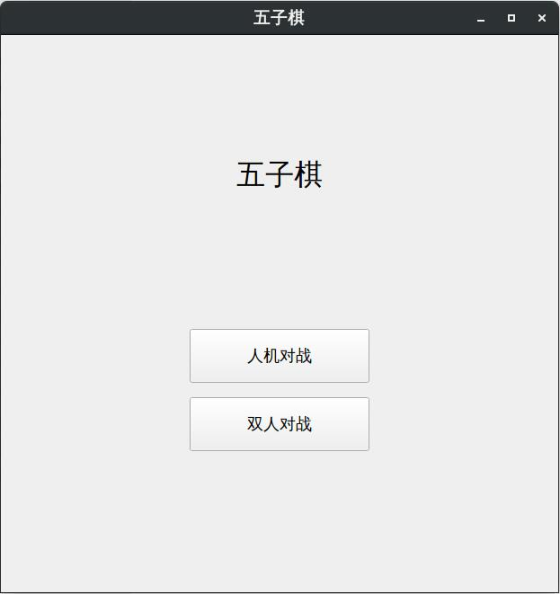

# 基于QT的五子棋小游戏

### 因为学习QT之后迫不及待想要练手, 看到github上有人已经用Js实现了很好的五子棋AI https://github.com/lihongxun945/gobang, 想要通过学习其中的算法在QT中实现一个五子棋的ai, 本游戏目前AI基本等于弱智级别, 并没有使用极大极小值算法, 使用了较为简单的局势评分法(比较初级的算法)去判定AI下一步要走的棋。本游戏之后不断更新迭代, 增加游戏内容以及算法更新。

### 游戏模式: PVP, PVE

# 运行项目

首先git clone 到本地的某个目录, 然后在Qt Creator中打开文件夹中GoBang_QT.pro, 最后构建项目